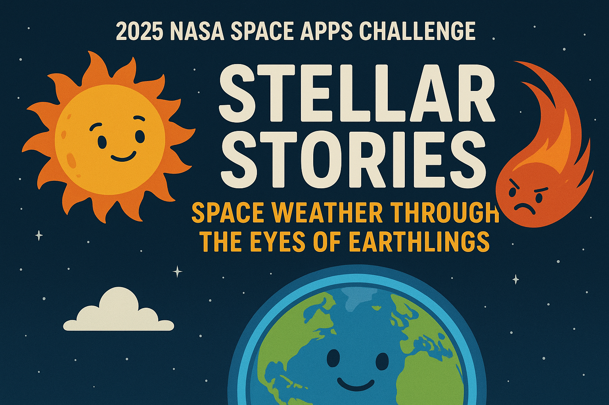
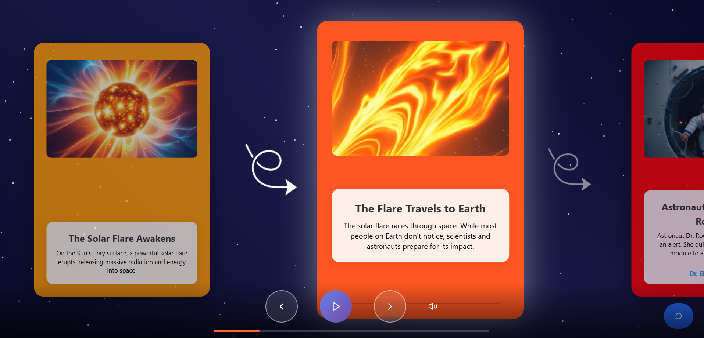
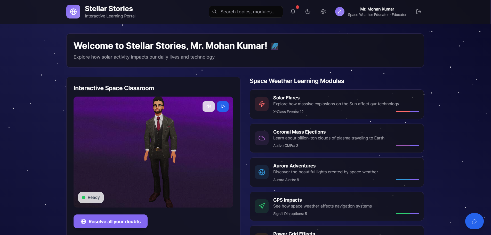
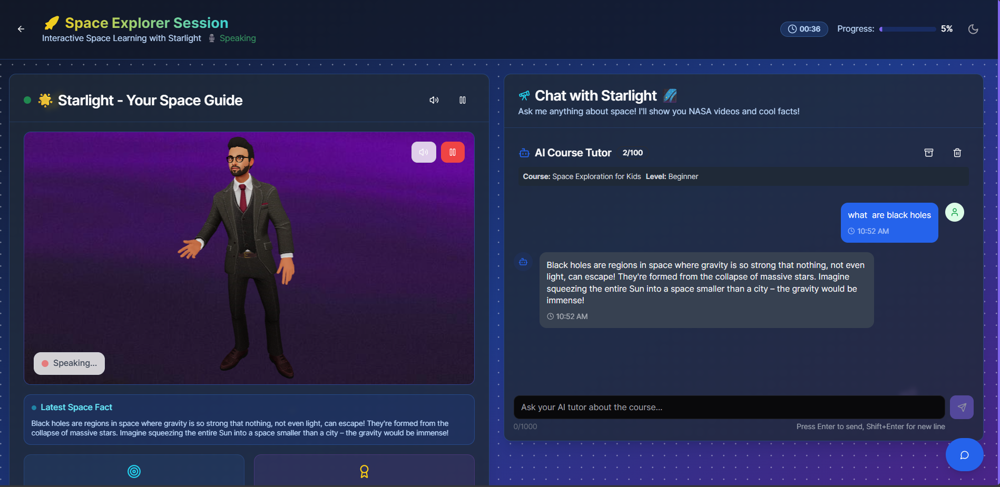

# Stellar Stories: Space Weather Through the Eyes of Earthlings


[](https://www.spaceappschallenge.org/)
[](https://opensource.org/licenses/MIT)

## 📸 Screenshots

### Project Banner


### Solar Flare Explanation


### Dashboard Interface


### Space Explorer Session


An interactive educational platform that teaches children about space weather through engaging 3D stories, AI-powered learning assistants, and immersive visualizations. Developed for the NASA Space Apps Challenge 2025.

## 🌟 Overview

**Stellar Stories** creates digital children's stories that explain space weather phenomena and their impacts on Earth. Through multiple perspectives (from affected Earthlings and space phenomena themselves), children learn about solar flares, coronal mass ejections, auroras, and how space weather affects technology and daily life.

### 🎯 Challenge Theme
"Stellar Stories: Space Weather Through the Eyes of Earthlings" - NASA Space Apps Challenge 2025

### 🎨 Key Features
- **Interactive 3D Stories**: Immersive narratives with solar system visualizations
- **AI Educational Assistant**: Gemini and OpenAI-powered chat for learning support
- **Multi-Perspective Storytelling**: Stories from farmers, pilots, astronauts, and space phenomena
- **Real-time Data Integration**: Live space weather monitoring
- **Child-Friendly Design**: Responsive, accessible interface for young learners

## 🏗️ Architecture

This project consists of two main components:

### Frontend Application
📁 [`stellar_stories-frontend/`](stellar_stories-frontend/README.md)
- **Tech Stack**: React 18, TypeScript, Three.js, Tailwind CSS
- **Features**: 3D visualizations, interactive stories, AI chat integration
- **Deployment**: Vercel/Netlify ready

### Backend API
📁 [`stellar_stories-backend/`](stellar_stories-backend/Readme.md)
- **Tech Stack**: FastAPI, MongoDB, JWT authentication
- **Features**: User management, course content, AI interactions
- **Deployment**: Render/Heroku ready

## 🚀 Quick Start

### Prerequisites
- Node.js 18+ and Bun
- Python 3.8+
- MongoDB (local or Atlas)

### Installation

1. **Clone the repository**
   ```bash
   git clone  https://github.com/LakshyaSaini25/stellar_stories.git
   cd stellar_stories
   ```

2. **Setup Backend**
   ```bash
   cd stellar_stories-backend
   python -m venv venv
   source venv/bin/activate  # On Windows: venv\Scripts\activate
   pip install -r requirements.txt
   ```

3. **Setup Frontend**
   ```bash
   cd ../stellar_stories-frontend
   bun install
   ```

4. **Environment Configuration**
   - Copy `.env.example` to `.env` in both directories
   - Configure API keys and database connections

5. **Start Services**
   ```bash
   # Terminal 1: Backend
   cd stellar_stories-backend
   uvicorn app.main:app --reload --host 0.0.0.0 --port 8000

   # Terminal 2: Frontend
   cd stellar_stories-frontend
   bun run dev
   ```

6. **Access Application**
   - Frontend: http://localhost:5173
   - Backend API: http://localhost:8000
   - API Docs: http://localhost:8000/docs

## 📚 Story Modules

- **Aurora Chaser**: Photographer's perspective on northern lights and GPS disruptions
- **CME Journey**: Coronal mass ejection's voyage to Earth
- **Farmer's GPS Crisis**: Precision agriculture during solar storms
- **Astronaut's Radiation Alert**: Space station crew safety protocols
- **Pilot's Communication Blackout**: Airline rerouting challenges

## 🛠️ Technology Stack

### Frontend
- **React 18** - Modern UI framework
- **TypeScript** - Type-safe development
- **Three.js** - 3D graphics and animations
- **Tailwind CSS** - Utility-first styling
- **shadcn/ui** - Component library
- **Firebase** - Authentication

### Backend
- **FastAPI** - High-performance API framework
- **MongoDB** - NoSQL database
- **Beanie** - MongoDB ODM
- **JWT** - Secure authentication
- **Pydantic** - Data validation

### AI & Integrations
- **Google Gemini AI** - Educational chat assistant
- **OpenAI API** - Enhanced AI capabilities
- **NASA APIs** - Real-time space weather data

## 🎯 Educational Impact

- **STEM Learning**: Makes complex space science accessible to children
- **Technology Awareness**: Teaches about space weather's real-world impacts
- **Multiple Perspectives**: Builds empathy through diverse viewpoints
- **Interactive Engagement**: 3D visualizations and AI chat increase learning retention

## 👥 Team

**Team Name: Phoenix Code**

### Team Members

| Name                  | Role                | Email                | LinkedIn | College |
|-----------------------|---------------------|----------------------|----------|---------|
| Lakshya Saini         | Backend Developer   | LakshyaSainibtechcse22-26@liet.in | [LinkedIn](https://www.linkedin.com/in/lakshya2513saini) | LIET |
| Pradeep Soni          | Backend Developer   | pradeepsoniofficial@gmail.com | [LinkedIn](https://www.linkedin.com/in/pradeepsoniofficial/) | LIET |
| Akshay Saini          | Frontend Developer  | akshaysainibtechcse22-26@liet.in | [LinkedIn](https://www.linkedin.com/in/akshay2513saini) | LIET |
| Brajesh Kumar         | Frontend Developer  | brajeshkumartechcse22-26@liet.in | [LinkedIn](https://www.linkedin.com/in/brajesh-kumar-068659319/) | LIET |
| Pranshu Gupta         | 3D Designer         | pranshuguptabtechcse22-26@liet.in | [LinkedIn](https://www.linkedin.com/in/pranshu-gupta-64b338370) | LIET |

## 📄 License

This project is licensed under the MIT License - see the [LICENSE](LICENSE) file for details.

## 🙏 Acknowledgments

- **NASA Space Apps Challenge** for the inspiring theme
- **Google Gemini AI** and **OpenAI** for AI capabilities
- **Three.js** community for 3D web technologies
- **React & FastAPI** communities for excellent frameworks

## 📞 Contact

- **Project Repository**: [GitHub Link]
- **Demo**: [Live Demo Link]
- **Documentation**: See individual README files in frontend/backend folders

---

**Made with ❤️ for NASA Space Apps Challenge 2025**

*Teaching children about space weather, one story at a time.*
